# fast-neural-style.tf

An implementation of [1][2].

Time: 0.05 seconds on NVIDIA TITAN X GPU for at resolution of 1200x630.

ModelName | Style | Samples
---       | ---   | ---
composition_v | 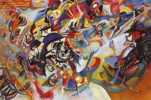 | 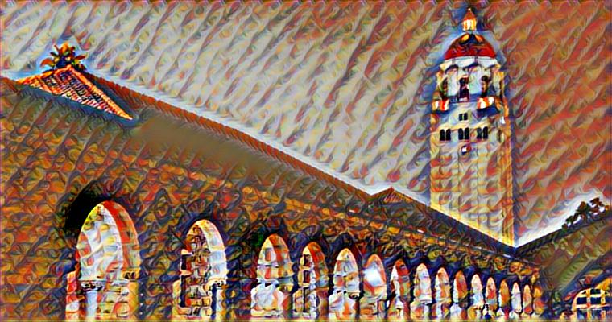
feathers | 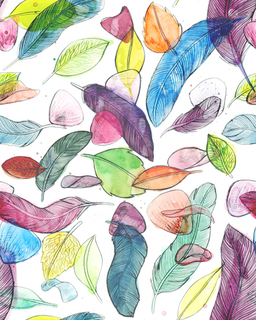 | 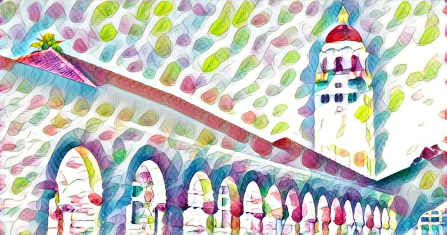
la_muse | 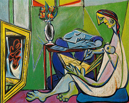 | 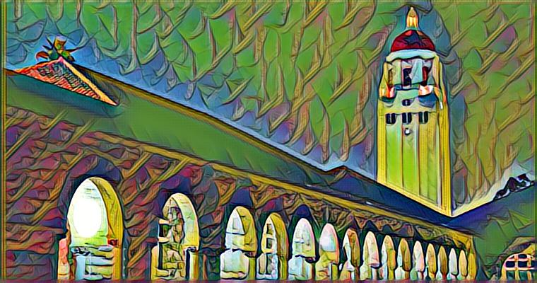
mosaic |  | 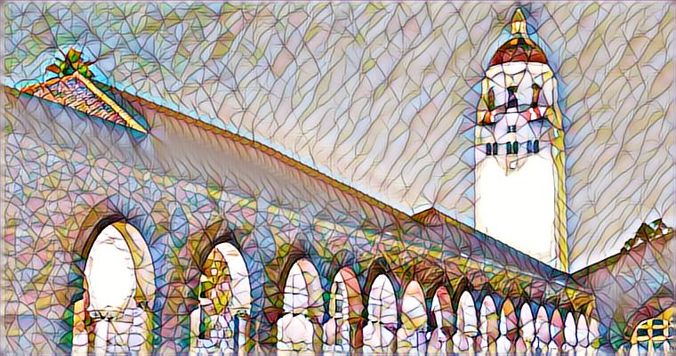
the scream | 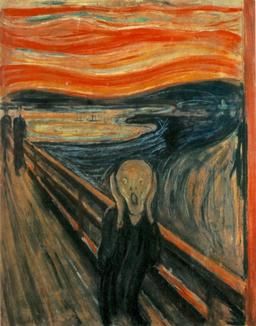 | 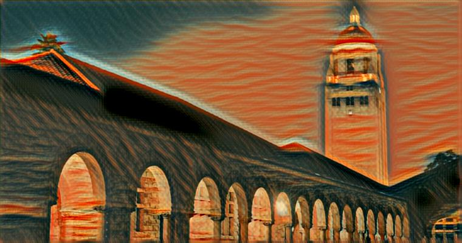
udnie | 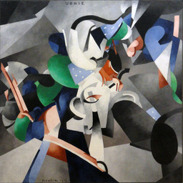 | 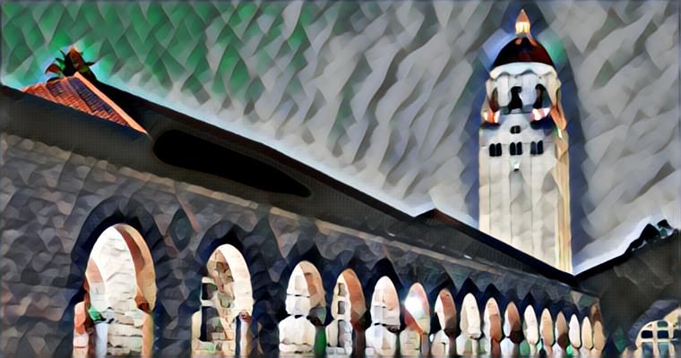
wave |  | 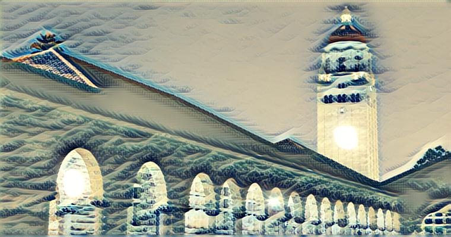
cubist | 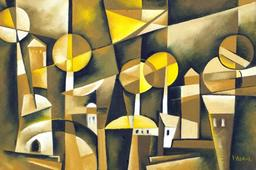 | 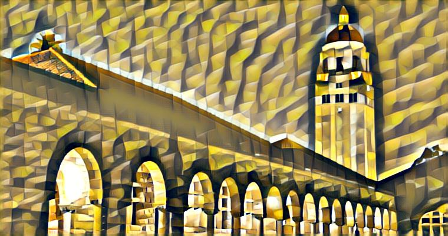

## Requirement
Tensorflow(>= r0.11), Numpy, Scipy, Pillow

## Usage

```{bash}
python render.py --input $INPUT_IMAGE --output $OUTPUT_FILE_NAME --model $MODEL_NAME --arch $GENERATOR_ARCH
```

## Training
Coming soon.

## License
MIT


## Reference
[1] Johnson, Justin, Alexandre Alahi, and Li Fei-Fei. "Perceptual losses for real-time style transfer and super-resolution." arXiv preprint arXiv:1603.08155.

[2] Ulyanov, Dmitry, Andrea Vedaldi, and Victor Lempitsky. "Instance Normalization: The Missing Ingredient for Fast Stylization." arXiv preprint arXiv:1607.08022.

[3] Gatys, Leon A., Alexander S. Ecker, and Matthias Bethge. "A neural algorithm of artistic style." arXiv preprint arXiv:1508.06576.

